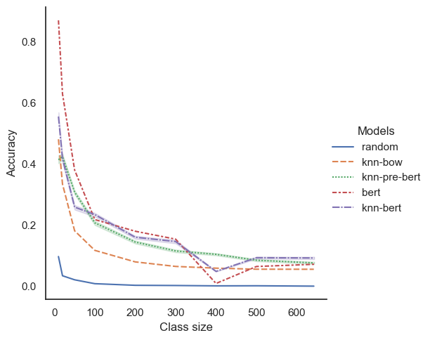

# Too many classes this semester: Analyzing BERT on a large multi-class classification problem
This is the repository for the project of the Team Laboratory Computational Linguistics course at the University of stuttgart in the summer term of 2022.

In this project, we analyze BERT's performance for increasing numbers of classes. We use artist classification from lyrics as an example task for that.

We compare the performance deterioration of two baselines, random choice and kNN with set-based BOW as representation, with fine-tuning BERT and evaluating the performance on the classification head as well as using the embeddings for kNN. Additionally, we experiment with using embeddings from pre-trained BERT for kNN. 

We evaluate these settings using accuracy.

Find the baseline kNN implementation [here](./baseline.py), examples for the random baseline and BERT experiments in the [bert_baseline](./notebooks/bert-baseline.ipynb) notebook and the full experiments for different numbers of classes in the [bert-diff-classes](./notebooks/bert-diff-classes.ipynb).

## Installation

To run the code, install the dependencies from the requirements file:

`$ pip install -r requirements.txt`

## Baselines

Run the kNN baseline experiments by specifying the number of classes `n` and how many processes to use for multiprocessing `p`:

`$ python baseline.py n p`

Note that the results will be logged in a log file. To change the name or directory, change the file name in the second to last line of the script.

## Dataset
Unfortunately, we have do not have the rights to distribute the dataset we used in this project. To use the code provided here with your own dataset, add your own training, validation and test datasets structured like [the example file](./data/songs_example.txt).

### Dataset description
Per instance (song), the dataset used includes a triple with the *artist name*, *song title* and the *lyrics* of a song. 

Overview over the number of artists/songs in the dataset:
- | | Train | Val | Test |
    --- | --- | --- | --- |
    Artists | 642 | 612 | 618 |
    Songs | 46,120 | 5,765| 5,765|

We provide a short descriptive data analysis [here](./notebooks/team-labs-descriptive-analysis.ipynb).

## Task: Artist classification
The artist classification task is to classify which artist performed/wrote a certain song given only the lyrics in a textual form.

## Results
While we find that for lower numbers of classes, fully fine-tuned BERT outperforms the baseline and the BERT kNN variants for lower numbers of classes, that trend does not hold for greater numbers of classes. For higher numbers of classes, using fine-tuned BERT embeddings with kNN outperforms the other methods.

| # of classes | random | knn-bow | knn-pre-bert | bert  | knn-bert |
|--------------|--------|---------|--------------|-------|----------|
| 10           | 0.098  | 0.481   | 0.481        | 0.87  | 0.614    |
| 20           | 0.035  | 0.335   | 0.455        | 0.63  | 0.44     |
| 50           | 0.022  | 0.182   | 0.328        | 0.381 | 0.28     |
| 100          | 0.009  | 0.118   | 0.224        | 0.219 | 0.25     |
| 200          | 0.004  | 0.08    | 0.157        | 0.181 | 0.174    |
| 300          | 0.003  | 0.065   | 0.127        | 0.155 | 0.165    |
| 400          | 0.002  | 0.06    | 0.116        | 0.001 | 0.055    |
| 500          | 0.002  | 0.056   | 0.095        | 0.065 | 0.103    |
| 643          | 0.001  | 0.056   | 0.088        | 0.073 | 0.104    |

Accuracy of different multi-class classification methods using different class sizes. First column represents the number of classes in each set that the methods are trained/evaluated on. `Knn-bow` refers to BOW representation with a kNN classifier. `Knn-pre-bert` refers to pre-trained BERT embeddings with a kNN classifier. `bert` refers to fine-tuned BERT model and `knn-bert` using the fine-tuned embeddings with kNN. Best results for each size is highlighted in bold.

# Appendix
Additionally to the functionality and experiments mentioned above, we conducted the following baseline experiments.

These experiments are conducted using the [k-nearest neighbors (KNN)](https://en.wikipedia.org/wiki/K-nearest_neighbors_algorithm) classifier ([implementation](./src/classifiers/knn.py)).

We experiment with different combinations of data representations and distance/similarity measures as well as with additional structural features (number of lines in lyric, length of lyric in words).

## Evaluation
We evaluate our experiments using Accuracy as well as micro-averaged Precision, Recall and F1-Score. Find these and the implementations macro-averaged metrics [here](./src/evaluation/evaluation.py).

## Data representations
We use two kinds of representations for the lyrics
- [Bags of Words (BOW)](https://en.wikipedia.org/wiki/Bag-of-words_model) implemented as sets ([implementation](./src/data_representations/bow.py))

    Distance/similarity measures:
    - [Tversky index](https://en.wikipedia.org/wiki/Tversky_index)
    - [Jaccard index](https://en.wikipedia.org/wiki/Jaccard_index)
    - [Sørensen–Dice coefficient](https://en.wikipedia.org/wiki/S%C3%B8rensen%E2%80%93Dice_coefficient)
    - [Overlap coefficient](https://en.wikipedia.org/wiki/Overlap_coefficient)

- [TF-IDF](https://en.wikipedia.org/wiki/Tf%E2%80%93idf) vectors ([implementation](./src/data_representations/tf_idf.py))

    Distance/similarity measures:
    - [Cosine similarity](https://en.wikipedia.org/wiki/Cosine_similarity)
    - [Euclidean distance](https://en.wikipedia.org/wiki/Euclidean_distance)

## Results
Find the experiments and results, and a tutorial on how to use our code  in these two notebooks: 
- [Experiments BOW](./notebooks/appendix_bow_experiments.ipynb)
- [Experiments Random Baseline and tf-idf](./notebooks/appendix_tf-idf_experiments.ipynb)

|                      |                            | 10k train |           | 20k train |           |
|----------------------|----------------------------|-----------|-----------|-----------|-----------|
|                      | Distance/similarity metric | Acc       | Micro-F1 | Acc       | Micro-F1 |
| Random choice        |                            | 0.004     | 0.007     | 0.001     | 0.002     |
| BOW                  | Jaccard                    | **0.07**  | **0.115** | **0.09**  | **0.149** |
|                      | Sørensen-Dice              | **0.07**  | **0.115** | **0.09**  | **0.149** |
|                      | Tversky                    | 0.06      | 0.094     | 0.05      | 0.083     |
| TF-IDF               | Cosine                     | **0.07**      | 0.108     | 0.08      | 0.125     |
|                      | Euclidean                  | 0.01      | 0.018     | 0.04      | 0.071     |
| TF-IDK + Stylometric features| Cosine                     | 0.02      | 0.032     | 0.01      | 0.017     |
|                      | Euclidean                  | 0.01      | 0.017     | 0.01      | 0.018     |